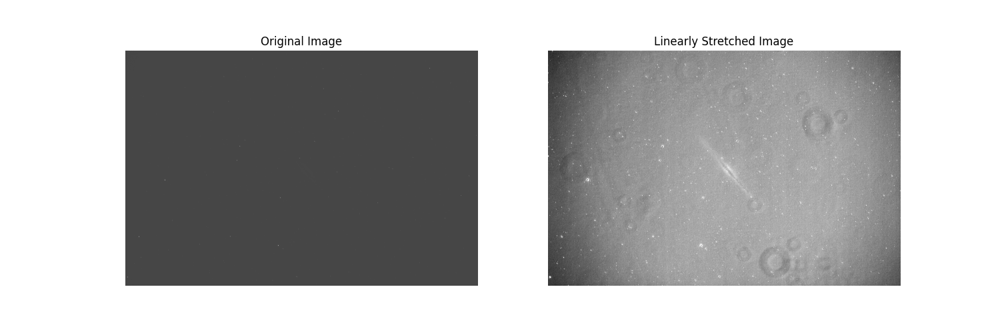

# Analysis of Signal Quality vs Exposure Time in Deep Sky Imaging
## Abstract
There is nothing novel about this project, it is merely an analysis of .fits data to "prove" that more exposure time leads to better image quality.
## Glossary
- Stacking
  - The process of adding several images in order to increase the signal to noise ratio (snr) of the final image. There are several methods for determining the final value of a pixel
    - The average value
    - The most common value
  - Usually stacking involves calibration steps (removing known problems with the camera and optical system)
  - All data in this paper has been stacked without calibration
- Stretching
  - Even with cooled CCD cameras, the images are very faint. When mapping the CCD values to the screen values, only the brightest objects appear. Stretching is a linear mapping of the CCD values to 
screen values, so that there is a mode complete spread of values. The image below shows the comparison of the original image vs the stretched image. Since the mapping is linear, it can be undone with out loss of information
  

## Introduction
The parameters that control image quality of Deep sky objects 
- Imaging Hardware, this includes optics, cameras  and scope tracking 
- Environment parameters, such as atmosphere and sky darkness 
- Exposure time

## Conclusion
## Next Steps

## References
